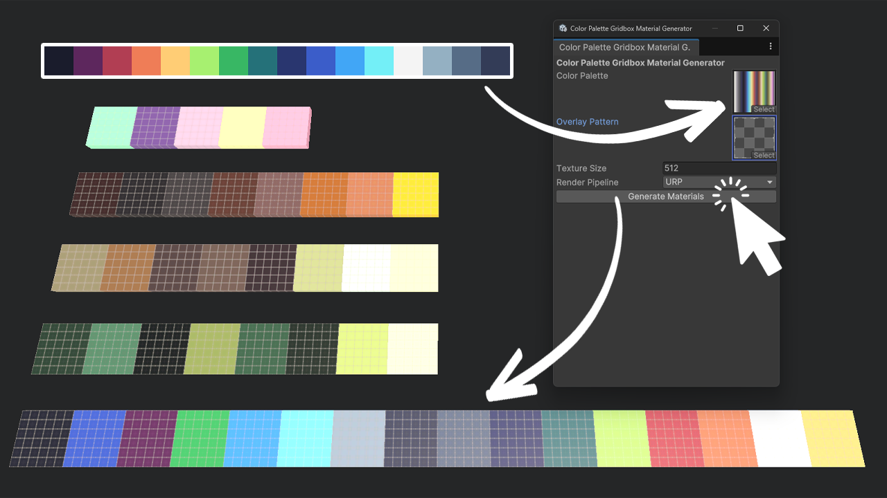

 
Color Palette Gridbox Material Generator
======================================

======================================
This Unity project contains a custom editor tool to generate materials based
on a color palette texture. The tool processes each color in the palette and
creates corresponding textures and materials.

--------------------------------------
How to Use
--------------------------------------

Install package from git URL: https://github.com/StephenHubbard/Color-Palette-Gridbox-Material-Generator.git

Video tutorial found here: https://www.youtube.com/watch?v=wmlg0QUW16M&ab_channel=StephenHubbard
1. Open Unity and navigate to:
Window > Tools > Color Palette Material Generator
2. Assign the following fields in the editor window:
- "Color Palette": A texture containing the color swatches.
IMPORTANT: The color palette must be a 1 x N pixel texture. E.g., Each
pixel represents a color swatch with a maximum height of 1 pixel.
- "Overlay Pattern": A texture to apply as an overlay.
- "Texture Size": Define the output texture resolution.
- "Render Pipeline": Choose between Built-in, URP, or HDRP materials.
3. Click the **"Generate Materials"** button.
4. Generated textures and materials will be stored in:
*Assets/Generated Materials/{PaletteName}/Textures*
*Assets/Generated Materials/{PaletteName}/Materials*
5. The materials folder will automatically open in the Unity Project window.

Note:  There is a sample scene with ready-to-use materials that can be installed via the Samples tab on the Unity package manager after importing the project. 

--------------------------------------
Requirements
--------------------------------------

- Unity 2021.3+ (LTS recommended)
- URP or HDRP package installed if selecting those pipelines.

--------------------------------------
Troubleshooting
--------------------------------------

- Ensure textures have "Read/Write Enabled" in import settings.
- Set "Non-Power of 2" to "None" for accurate color processing.
- If materials do not appear, check the console for errors.

Note: Textures should automatically be set to these importer setting values
during the generation process.

Note: Non-Power of 2 textures is set this way to prevent color inaccuracies
when processing to account for Unity's texture compression.

--------------------------------------
License
--------------------------------------

This project is licensed under the MIT License.
Feel free to modify and use it in your own projects.

--------------------------------------
Author
--------------------------------------

Developed by: Stephen Hubbard

https://github.com/StephenHubbard

https://www.youtube.com/@_stephenhubbard

--------------------------------------
Demo Scene Example Palette Attribution
--------------------------------------

- https://lospec.com/palette-list/ammo-8
- https://lospec.com/palette-list/blessing
- https://lospec.com/palette-list/chocomilk-8
- https://lospec.com/palette-list/ice-cream-gb
- https://lospec.com/palette-list/rust-gold-8
- https://lospec.com/palette-list/sweetie-16

--------------------------------------

